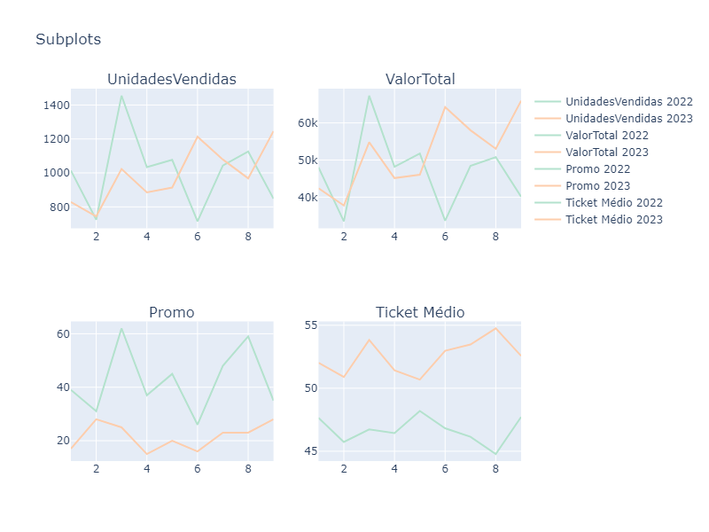
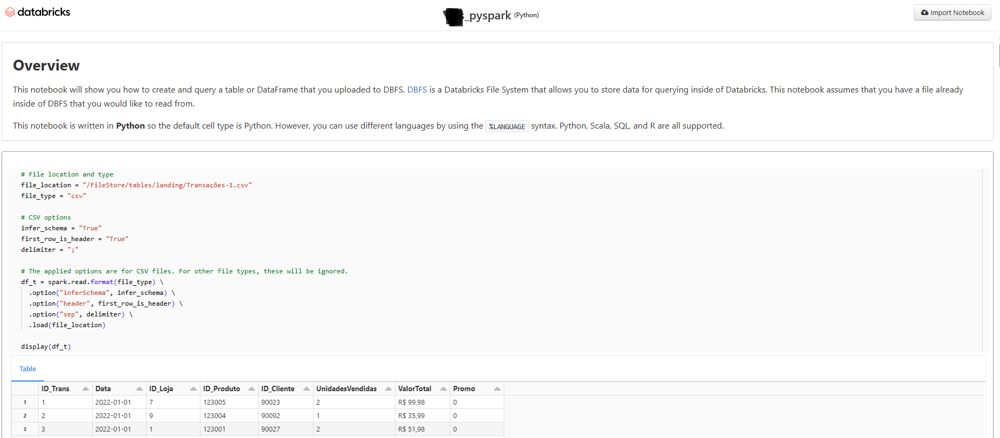

# department store clothing retail

simulation of a database of garments and their categories, stores, geography, customers and transactions. python (VSCode) and pyspark codes (databricks) were used for the analysis. 

In this files you will find hypothetical data for a retailer from 2023 and 2022 (January to September). In the green tabs you'll find 4 small databases, which contain the raw transaction data and the product, store and customer dimensions.

## analyses

* Step 1: Cleaning and preparing data
* Step 2: main KPIs that summarize the behavior of the base
* Step 3: in-depth product analysis
* Step 4: A/B testing

## Usage

crm_v5_1_1.ipynb has the complete analysis and bds_pyspark.ipynb is a test simulating the use of bigdata with the translation of the python codes into pyspark (databricks). 

## figures png

the .png figures are the outputs of the graphical analysis.

 

## parquet files

you can adapt the codes to read .parquet files

## pyspark code

 